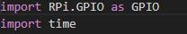
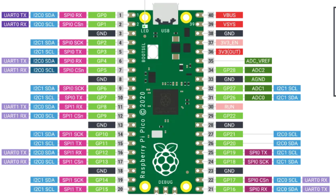
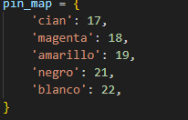
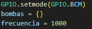
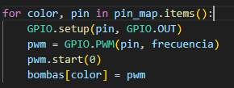
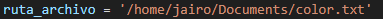
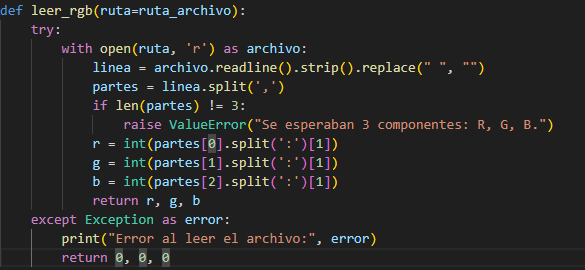
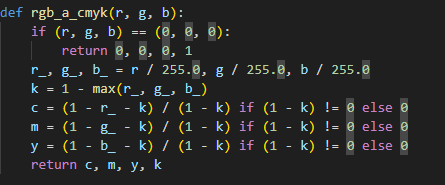
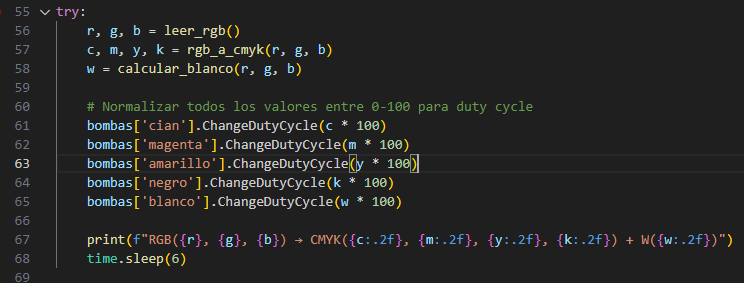
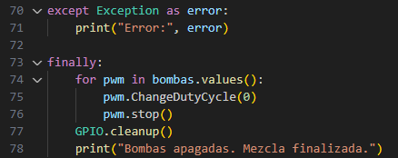

# Lab06: Proyecto 2da. entrega

## Integrantes
Roland Lara 
Jairo Casallas
Nicolas Cuartas
## Documentación
¿Funcionamiento del sistema?
Este proyecto sirve para crear colores mezclando pinturas, usando un microcontrolador Raspberry Pi Pico, unas bombas con puentes H y programación.

Conexión:
Hay 5 bombas, una para cada color de CMYK y Blanco: cian, magenta, amarillo, negro y blanco.

Estas bombas se conectan directo a los puente H, que actúan como un interruptor, capaz de manejar la corriente de los motores.

Los puentes H están alimentados con 5 voltios.

Desde Raspberry Pi Pico, lo que se hace es mandar señales PWM a cada bomba, para decirle con qué fuerza debe funcionar.

Código:

En el codigo que se desarrollo, se inicia importando las librerias GPIO que permite controlar los pines GPIO de la raspberry Pico, de igual forma el módulo estándar de python para time, que ofrece funciones relacionadas con el tiempo.

Posteriorse crea un diccionario pin_map que asigna a cada pin GPIO un color cmykw para la respectiva conexión de cada bomba de succión.

Creamos un diccionario llamado bombas{} vacio para almacenar los objetos PWM que se asociaran a cada bomba.Manejaremos una frecuencia de 1000 Hz o du equivalente 1KHz.

En el for que se creo para recorrer cada color creado en el pin_map; configurando de esta manera los GPIO como salidas, para el pwm crea un objeto PEM para el pin con la frecuencia especificada. En pwm.start(0) inicia la señal con un ciclo de trabajo al 0%. Para bombas[color] almacenamos el objeto PWM en el diccionario bajo la clave que le corresponde a cada color.

En la línea 23 del código se hace el llamado de la ruta donde se encuentra el archivo .txt guardado en la memoria de la raspberry 2W; el cual contiene la información suministrada desde Node Red, en formato RGB.

Desde la línea 25 a la línea 38 definimos la función leer_rgb; desde la ruta_archivo donde eliminamos los espacios, separamos los datos con comas(,); y cuando presenta error nos los mostrara (0,0,0) con un mensaje indicando este error.

En las líneas 40-48 definimos la función rgb_a_cmyk(r, g, b); donde tomamos los valores obtenidos en RGB del archivo .txt. Normalizamos los datos entre 0 a 1; diviendo los valores obtenidos por cada color dividiendolos en 255; para obtener el valor del color negro simbolizado por la letra K se escoge el valor maximo entre RGB y se realiza la resta. Para calcular el valor de cada color se hace la resta (1-r-k)/(1-k) y cambia r por g o por b dependiendo de CMY; al final la función returna CMYK.

De las líneas 50 a 53 definicimos la función calcular_blanco(r,g,b) donde normalizamos los valores de RGB dividiendolos en 255 y el de menos valor es el que tomaremos de referencia para tomar como color blanco. De las líneas 55 a 68 llamamos a la función rgb_a_cmyk(r, g, b) después que fueron normalizamos múltiplicamos *100 para saber el ciclo de trabajo de cada bomba de succión. El código imprime la cantidad de cada color CMYKW con dos decimas.

En caso de que ocurra un error durante la ejecución del programa, este es capturado y mostrado en pantalla gracias al bloque except. Esto permite detectar problemas como errores en la lectura del archivo, en la conversión de colores o en la activación de las bombas.

Independientemente de si el proceso finaliza correctamente o con errores, el bloque finally garantiza una correcta limpieza del sistema. En este bloque se apagan todas las bombas estableciendo su ciclo de trabajo (duty cycle) a 0%, se detienen los procesos PWM asociados y se ejecuta GPIO.cleanup() para liberar los pines GPIO utilizados, dejándolos en estado seguro.

Finalmente, se muestra un mensaje de confirmación indicando que las bombas han sido apagadas y que la mezcla ha finalizado correctamente.

Lee un archivo CSV con los datos de CMYK Y Blanco, por ejemplo:

C:100, M:50, Y:0, K:30, W:10

El código toma esos números y calcula cuánto corresponde a cada color en relación con los otros. 

Activa las bombas:
En lugar de encenderlas por un tiempo diferente, todas se encienden por el mismo tiempo (por ejemplo, 6 segundos), pero cada una bombea más o menos rápido según lo que se necesita. Esa velocidad la maneja la señal PWM.

Se apagan todas:
Después del tiempo de mezcla, el código apaga todas las bombas. Y listo: se obtiene el color deseado.

¿Qué se logra con esto?
Con solo escribir qué color quieres en un archivo, el sistema mezcla la pintura por ti, sin errores, sin tener que medir a mano, y siempre igual. Ideal para automatizar procesos de pintura, arte, o incluso máquinas de impresión líquida.

NODE RED, interface 

En la interface Node Red observamos el selector de colores, una vez seleccionado el color nos arroja los porcentages de RGB o CMYK y Blanco, que al final serán recibidos por las bombas

Consiguiente podemos observar que el bloque 'color.txt' es un archivo de texto donde vamos a guardar todos los datos obtenidos de la interfaz Node Red, con el fin de que cuando demos clic en 'Activar' desde la interfaz de Node Red, el bloque de código 'bombas.py' se ejecutará desde el equipo embebido Raspberry.

se anexan dos archivos .py el primero llamado bombas.py que recibe los datos en formato RGB y realiza el proceso de activación de 3 bombas, el segundo archivo es llamado bombascmyk.py que recibe datos en RGB y los convierte en formato CMYK.

## Conexión de la bomba con el módulo L298N

A continuación se muestra el diagrama de conexión entre la Raspberry Pi Pico y el módulo puente H L298N, que controla dos motores (o bombas):

> ⚠️ **Importante:**  
> El módulo L298N **no activa las salidas hacia las bombas** si no se aplica voltaje en **ambas entradas de alimentación**:  
> - **+12V** (alimentación principal para los motores)  
> - **5V o 12V en el pin de `VCC` interno**, dependiendo de si se está usando o no el jumper de regulación.  
>
> Asegúrarse de:
> - Aplicar el voltaje de motor en el pin `+12V`.
> - Proporcionar tierra común (`GND`) entre la fuente, la Raspberry Pi y el L298N.
> - Verificar que el jumper de 5V esté bien colocado si usas el regulador interno del módulo.
> - Podemos realizar un puente entre los pines de 12V y el de 5V en el modulo L298N.
Esta conexión se realiza cuando se le da un sentido a las bombas de succión ya sea para succión o expulsión de pintura; si se desea solo para succión se deja el pin de 12V.

