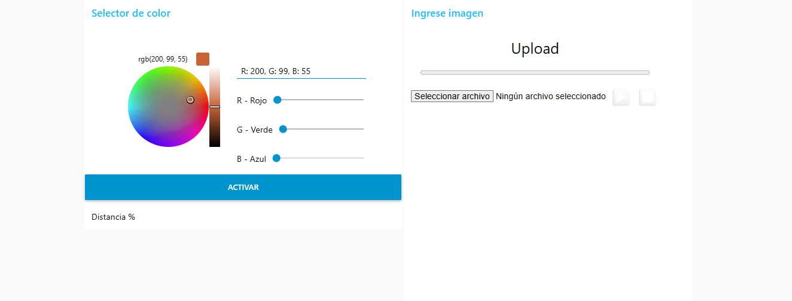
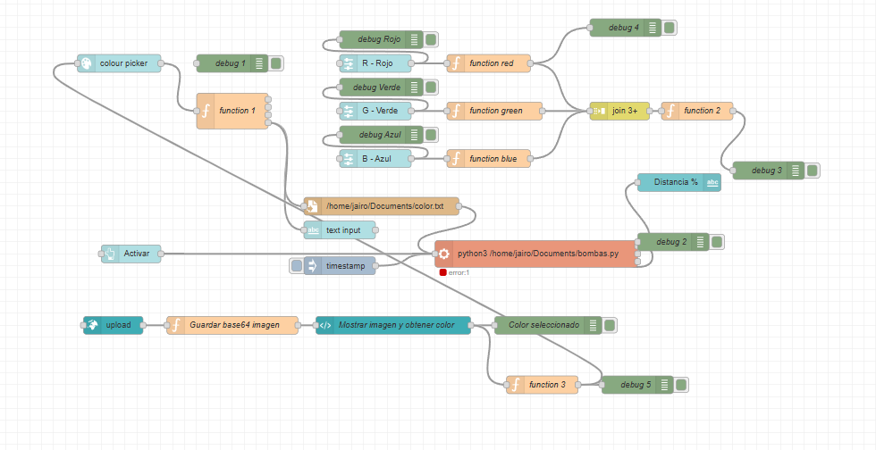
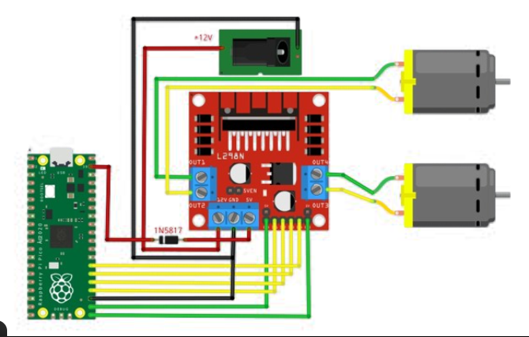

# Lab06: Proyecto 2da. entrega

## Integrantes
Roland Lara 
Jairo Casallas
Nicolas Cuartas
## Documentación
¿Funcionamiento del sistema?
Este proyecto sirve para crear colores mezclando pinturas, usando una un microcontrolador Raspberry Pi Pico, unas bombas con puentes H y programación.

Conexión
Hay 5 bombas, una para cada color de CMYK y Blanco: cian, magenta, amarillo, negro y blanco.

Estas bombas se conectan directo a los puente H, que actúan como un interruptor, capaz de manejar la corriente de los motores.

Los puentes H están alimentados con 5 voltios.

Desde Raspberry Pi Pico, lo que se hace es mandar señales PWM a cada bomba, para decirle con qué fuerza debe funcionar.

Código
Lee un archivo CSV con los datos de CMYK Y Blanco, por ejemplo:

C:100, M:50, Y:0, K:30, W:10

El código toma esos números y calcula cuánto corresponde a cada color en relación con los otros. 

Activa las bombas:
En lugar de encenderlas por un tiempo diferente, todas se encienden por el mismo tiempo (por ejemplo, 6 segundos), pero cada una bombea más o menos rápido según lo que se necesita. Esa velocidad la maneja la señal PWM.

Se apagan todas:
Después del tiempo de mezcla, el código apaga todas las bombas. Y listo: se obtiene el color deseado.

¿Qué se logra con esto?
Con solo escribir qué color quieres en un archivo, el sistema mezcla la pintura por ti, sin errores, sin tener que medir a mano, y siempre igual. Ideal para automatizar procesos de pintura, arte, o incluso máquinas de impresión líquida.

NODE RED, interface 

En la interface Node Red observamos el selector de colores, una vez seleccionado el color nos arroja los porcentages de RGB o CMYK y Blanco, que al final serán recibidos por las bombas

Consiguiente podemos observar que el bloque 'color.txt' es un archivo de texto donde vamos a guardar todos los datos obtenidos de la interfaz Node Red, con el fin de que cuando demos clic en 'Activar' desde la interfaz de Node Red, el bloque de código 'bombas.py' se ejecutará desde el equipo embebido Raspberry.

## Conexión de la bomba con el módulo L298N

A continuación se muestra el diagrama de conexión entre la Raspberry Pi Pico y el módulo puente H L298N, que controla dos motores (o bombas):

> ⚠️ **Importante:**  
> El módulo L298N **no activa las salidas hacia las bombas** si no se aplica voltaje en **ambas entradas de alimentación**:  
> - **+12V** (alimentación principal para los motores)  
> - **5V o 12V en el pin de `VCC` interno**, dependiendo de si se está usando o no el jumper de regulación.  
>
> Asegúrarse de:
> - Aplicar el voltaje de motor en el pin `+12V`.
> - Proporcionar tierra común (`GND`) entre la fuente, la Raspberry Pi y el L298N.
> - Verificar que el jumper de 5V esté bien colocado si usas el regulador interno del módulo.
> - Podemos realizar un puente entre los pines de 12V y el de 5V en el modulo L298N.
Esta conexión se realiza cuando se le da un sentido a las bombas de succión ya sea para succión o expulsión de pintura; si se desea solo para succión se deja el pin de 12V.

